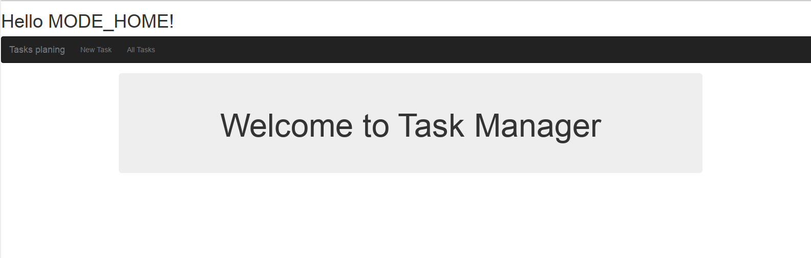
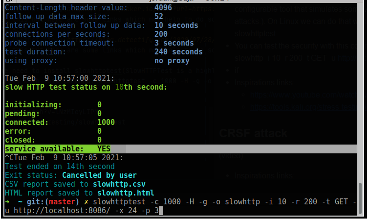

# Cybersec
- This project in a global way consists in highlighting the different security vulnerabilities that an application can have
- We built a small project to shed light on the security flaw
- I have two codes, one secure and the other insecure
    * The secure code is on the *main* branch
    * The insecure code is on the *code-insecure* branch
- A preview image of this projet

### How to run this code
- First step:
- Second step:
    * Run the command  java -jar target/secu-0.0.1-SNAPSHOT.jar  
    

### Built With
- HTML, CSS, Bootstrap
- Spring
### Tool used
- Regex101(https://regex101.com/) in order to find the correct regex 
### The security vulnerabilities that we exploit
- SQL injection (https://www.w3schools.com/sql/sql_injection.asp)
- Clickjacking (https://en.wikipedia.org/wiki/Clickjacking)
- Cross-site scripting(XSS)  (https://owasp.org/www-community/attacks/xss/)
- ...

## We are in the main branch, so the secure branch
### A) Injection SQL attack 
SQL attacks :
1) Use predefined functions for request such as saveAndFlush in order to prevent Sql injections.
With these predefined functions in Spring boot, every element entered by the user are transformed in text.
2) One other way to prevent SQL injections is to use prepared request
(https://www.journaldev.com/34028/sql-injection-in-java)
3) We can also remove special characters for protecting our code from SQL injection by using regex with the objective to
identify special characters and syntaxes SQL. I can suggest as regex (\b(select)\b|\b(SELECT)\b|(\b(from)\b)|(\b(FROM)\b)|\*|\'|(\b(and)\b)| (\b(AND)\b)|\=|(\b(where)\b)|(\b(WHERE)\b)) 

- Inside my secure code, I chose the options **1** and **3**.

- In my demo concerning the securisation of this attack bellow you can see when I remove these codes
        task.setDescription(task.getDescription().replaceAll("(\\b(select)\\b|\\b(SELECT)\\b|(\\b(from)\\b)|(\\b(FROM)\\b)|\\*|\\'|(\\b(and)\\b)| (\\b(AND)\\b)|\\=|(\\b(where)\\b)|(\\b(WHERE)\\b))", ""));
        task.setName(task.getName().replaceAll("(\\b(select)\\b|\\b(SELECT)\\b|(\\b(from)\\b)|(\\b(FROM)\\b)|\\*|\\'|(\\b(and)\\b)| (\\b(AND)\\b)|\\=|(\\b(where)\\b)|(\\b(WHERE)\\b))", ""));
 inside MainController even I insert for exemple a syntaxes SQL in my field the predefined function of spingboot(saveAndFlush) transform the data to String. I insert the code with regex for conserving the consistency of my data

### B) Clickjacking attack & XSS & Web Cache Poisoning Attacks & HTTP attack & CSRF
I used **Spring security**(https://spring.io/projects/spring-security) in my code.
The implementation of spring security allow us to secure by default our application against certain attacks such as:
1) Clickjacking: https://en.wikipedia.org/wiki/Clickjacking
2) XSS : https://owasp.org/www-community/attacks/xss/
3) Web Cache Poisoning Attacks : https://link.springer.com/referenceworkentry/10.1007%2F978-1-4419-5906-5_666
4) HTTP attack: https://blog.qualys.com/vulnerabilities-research/2011/11/02/how-to-protect-against-slow-http-attacks
5) CRSF attack: https://portswigger.net/web-security/csrf

**Here you can find some documentations which speack about the security by default when we use spring security:** 
- https://www.baeldung.com/spring-security-csrf
- https://spring.io/blog/2013/08/23/spring-security-3-2-0-rc1-highlights-security-headers#content-type-options

# How to test of my code concerning the attacks cited above ?
### SQL Attacks
Here we can try to insert inside the input field in order to test :
- maths'
- ‘ or 1=1;–
- ‘ or 1=1; drop table t_tasks; —
inspiration link: https://www.softwaretestinghelp.com/sql-injection-how-to-test-application-for-sql-injection-attacks/
### Clickjacking
- Some links which can help ([first link](https://clickjacker.io/test?url=https:%2F%2Fwww.isnov.com%2Fhome%2F), [second link](https://www.lookout.net/test/clickjack.html))
,I could not able to test this but here are some links which may help to do so
### Web Cache poisoning Attacks
- Some links which can help ([first link](https://blog.detectify.com/2020/07/28/do-you-trust-your-cache-web-cache-poisoning-explained/), [second link](https://portswigger.net/research/practical-web-cache-poisoning))
,I could not able to test this but here are some links which may help to do so
### HTTP attack 
 - To test this attack we need to install slowhttptest(SlowHTTPTest is a highly configurable tool that simulates some Application Layer Denial of Service attacks.). On Linux we can do that with this command:  sudo apt-get install slowhttptest.
 - You can test the security with this command: 
    *slowhttptest -c 1000 -H -g -o slowhttp -i 10 -r 200 -t GET -u http://localhost:8086/ -x 24 -p 3
 - if service available:   YES
    * if **service available: YES** then the system is secure
 - You can see my test on the image bellow
    * 
 - Inspirations links:
   * https://www.youtube.com/watch?v=lNzMIeyLIPM
   * https://tools.kali.org/stress-testing/slowhttptest

### CRSF attack
I could not able to test this because I don't really use sessions or cookies.

### What I think insecure
- The user can change the page through the URL, especially the edit-task page, he can change the task he wants to edit through the URL. He just has to change the id for do that,
I don't know for the moment how to secure this part if it's eventually a problem as I think. I didn't have the time to look for deep about this.

## Author
**Daniel Jordan Sipe Tchawou**
- Github: [tchawou-daniel](https://github.com/tchawou-daniel)
- Linkedin: [linkedin](https://linkedin.com/in/daniel-jordan-sipe-tchawou)
