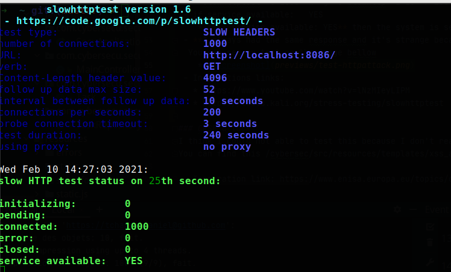

# Cybersec
- This project in a global way consists in highlighting the different security vulnerabilities that an application can have
- We built a small project to shed light on the security flaw
- I have two codes, one secure and the other insecure
    * The secure code is on the *main* branch
    * The insecure code is on the *code-insecure* branch
- A preview image of this projet

### How to run this code
- First step:
- Second step:
    * Run the command  java -jar target/secu-0.0.1-SNAPSHOT.jar  
    

### Built With
- HTML, CSS, Bootstrap
- Spring
### Tool used
- Regex101(https://regex101.com/) in order to find the correct regex 
### The security vulnerabilities that we exploit
- SQL injection (https://www.w3schools.com/sql/sql_injection.asp)
- Clickjacking (https://en.wikipedia.org/wiki/Clickjacking)
- Cross-site scripting(XSS)  (https://owasp.org/www-community/attacks/xss/)
- ...

## We are in the code-insecure branch, so the insecure branch
### A) Injection SQL attack 
A SQL injection attack consists of insertion or “injection” of a SQL query via the input data from the client to the application.

### B) Clickjacking attack & XSS & Web Cache Poisoning Attacks & HTTP attack & CSRF
I used **Spring security**(https://spring.io/projects/spring-security) in my code.
The implementation of spring security allow us to secure by default our application against certain attacks such as:
1) Clickjacking: https://en.wikipedia.org/wiki/Clickjacking
2) XSS : https://owasp.org/www-community/attacks/xss/
3) Web Cache Poisoning Attacks : https://link.springer.com/referenceworkentry/10.1007%2F978-1-4419-5906-5_666
4) HTTP attack: https://blog.qualys.com/vulnerabilities-research/2011/11/02/how-to-protect-against-slow-http-attacks
5) CRSF attack: https://portswigger.net/web-security/csrf

# How to test of my code concerning the attacks cited above ?
### SQL Attacks
**Injection Sql**
Here we can try to insert these inside the input field in order to destroy the database :
- maths'
- ‘ or 1=1;–
- ‘ or 1=1; drop table t_tasks; —

Inspire link:
- https://free.codebashing.com/courses/java/lessons/sql_injection

**Injection UNION attack** :
When performing an SQL injection UNION attack, there are two effective methods to determine how many columns are being returned from the original query.

The first method involves injecting a series of ORDER BY clauses and incrementing the specified column index until an error occurs.

For example, assuming the injection point is a quoted string within the WHERE clause of the original query, you would submit:
- ' ORDER BY 1--
- ' ORDER BY 2--
- ' ORDER BY 3--
- etc.

Inpiration link: 
- https://portswigger.net/web-security/sql-injection/union-attacks
### Slow HTTP attack
 - To test this attack we need to install slowhttptest(SlowHTTPTest is a highly configurable tool that simulates some Application Layer Denial of Service attacks.). On Linux we can do that with this command:  sudo apt-get install slowhttptest.
 - You can test the security with this command: 
    *slowhttptest -c 1000 -H -g -o slowhttp -i 10 -r 200 -t GET -u http://localhost:8086/ -x 24 -p 3
 - if service available:   YES
    * if **service available: YES** then the system is secure
 - **I always had the same response and it's strange because I didn't implement or try to implement the Spring security**.
  You can see my test on the image bellow
    * 
 - Inspirations links:
   * https://www.youtube.com/watch?v=lNzMIeyLIPM
   * https://tools.kali.org/stress-testing/slowhttptest
   
### CRSF attack
I think I could not able to test this because I don't really use sessions or cookies. But I implement à code with can help to exploit in the case of a using sessions or cookies.
You can find this /cybersec/src/resources/templates/xss_attack.html

 - Inspiration link: https://www.enisa.europa.eu/topics/csirts-in-europe/glossary/cross-site-scripting-xss

### What I think insecure
- The user can change the page through the URL, especially the edit-task page, he can change the task he wants to edit through the URL. He just has to change the id for do that,
I don't know for the moment how to secure this part if it's eventually a problem as I think. I didn't have the time to look for deep about this.

## Author
**Daniel Jordan Sipe Tchawou**
- Github: [tchawou-daniel](https://github.com/tchawou-daniel)
- Linkedin: [linkedin](https://linkedin.com/in/daniel-jordan-sipe-tchawou)
